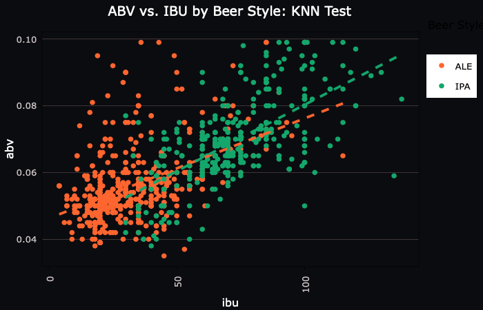

# Portfolio

## SMU Projects
---
### Doing Data Science - Fall 2019
---
[Budweiser IPA Exploratory Analysis](/eda.html)
#### <i>An analysis of craft brewery data to analyze a potential for a Budwesier IPA. Key points include choropleth analysis with state consensus data in addition to defining IPA classification by ABV and IBU levels. For source files, see <a href="https://www.dropbox.com/s/yh5k5kcr9pb774v/DDS_Midterm.zip?dl=1">download</a>.<i>

---
[RShiny Beer Exploration Dashboard](https://bstephan94.shinyapps.io/beer_dashboard/)
#### <i> Utilized RShiny, Plotly, GGplot2, Dplyr, adn more to create an interactice dashboard on analysis of ABV and IBU for over 2000 craft beers. <i>

---

## Kaggle Projects
---
### [2019 Data Science Bowl (PBS Kids)](https://www.kaggle.com/c/data-science-bowl-2019)
#### <i>Currently working on a team with 4 other data science students to create a machine learning model to predict game sucess rates...will post files as they become available.<i>
  

